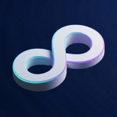

  

  <h1>SecondLoop</h1>
  
<b>Close your open loops.</b>

  
本地优先的个人 AI 助手：长期记忆 + 加密 Vault，面向移动端与桌面端。

  
<a href="https://secondloop.app">https://secondloop.app</a>

  

    简体中文 · <a href="README.md">English</a>
  

  

    <a href="CONTRIBUTING.md">贡献指南</a>
  

> ✅ **正式发布**
> SecondLoop Community Edition 已正式上线（macOS / Windows / Android / Linux x64）。常规版本不再计划引入破坏性数据格式变更。

## ✨ SecondLoop 是什么？

SecondLoop 是一个（Community Edition）**开源**、隐私优先的 “Second Brain”，帮你更快地 **捕获**、**记住**、并 **执行** —— 而不是让你管理一堆文件夹和标签页。

它的核心心智模型是 **一条时间轴（Main Stream）**：先记录，再在需要时提问。

## ⭐ 亮点

- 🧠 **长期记忆，本地优先**：默认加密存储在你的设备上。
- 🔥 **热度感知召回**：当语义分数接近时，最近且高频使用过的记忆会获得额外排序加成。
- 🧩 **稳定生成记忆**：会把长期偏好、用户画像、事件与模式提炼成仍然保留在本地加密知识索引中的文档。
- 📝 **更适合规划类问题的摘要**：面对计划/总结类提问时，会优先给出紧凑的 session digest，再补充来源证据，减少重复碎片。
- 🧲 **Ask AI 更贴合你的内容**：基于你的笔记与记录给出回答，并支持流式输出。
- 🗂️ **需要时再筛选**：按标签快速收窄查看范围，不需要维护一堆聊天线程。
- 📥 **随手收集**：移动端分享入口 + 桌面端全局快捷键，想到就记。
- 🔐 **隐私优先**：加密 Vault，数据放哪里由你决定。
- 🌍 **跨平台一致体验**：移动端和桌面端都可使用。

## 🤖 AI 功能能力矩阵（本地 / BYOK / Pro）

| AI 功能 | 本地（设备侧） | BYOK（自带 API Key） | Pro 订阅（SecondLoop Cloud） | 说明 |
| --- | --- | --- | --- | --- |
| 图片注释 | ⚠️ 基础设备侧描述 | ✅ 使用你自己的模型 API | ✅ SecondLoop Cloud 内置 | 网络 AI 不可用时，仍可基于图片可见文字给出轻量描述。 |
| OCR（图片/PDF/文档） | ✅ 设备侧文字识别 | ✅ 使用你自己的模型 API | ✅ SecondLoop Cloud 内置 | 适用于图片与支持的文档类型。 |
| 语音识别（音频转写） | ⚠️ 支持设备可用 | ✅ 使用你自己的模型 API | ✅ SecondLoop Cloud 内置 | 离线时会优先使用本地可用的转写能力。 |
| Embedding 索引 | ✅ 本地记忆索引 | ✅ 使用你自己的 embedding API | ✅ SecondLoop Cloud 内置 | 新内容会在后台持续建立索引。 |
| Ask AI | ❌ | ✅ 使用你自己的对话模型 API | ✅ SecondLoop Cloud 内置 | 路由会按你的来源偏好和当前可用性自动选择。 |
| 语义识别（意图/时间窗） | ❌ | ✅ 使用你自己的模型 API | ✅ SecondLoop Cloud 内置 | 用于智能理解与自动动作能力。 |
| Embedding 搜索 | ✅ 本地语义检索 | ✅ 使用你自己的 embedding API | ✅ SecondLoop Cloud 内置 | 会在可用路由间自动回退。 |

- `本地` 表示 iOS / Android / macOS / Windows / Linux 客户端内的设备侧处理。
- `BYOK` 表示你在设置中连接自己的模型服务与 API Key。
- `Pro` 表示账号具备 SecondLoop Pro 权益且已登录云端账号。
- 能力会继续迭代，但公开版本会优先保证兼容性与可升级性。

## 🚀 用法

### 获取方式

- 请从 [GitHub Releases](https://github.com/dale0525/SecondLoop/releases) 下载（包含 macOS/Windows/Android/Linux 资产）。
- iOS **暂未上线**。
- 若需从源码运行，请查看 `CONTRIBUTING.md`。

### 包管理器安装（可选）

- macOS（Homebrew）：
  - `brew tap dale0525/SecondLoopHomebrew`
  - `brew install --cask secondloop`
- Windows（WinGet）：
  - `winget install --id SecondLoop.SecondLoop --exact`
- 新标签发布后，包管理器索引相对 GitHub Releases 可能会有短暂延迟。

### Linux 版本说明（当前限制）

- Linux 目前提供便携式 `.tar.gz` 包（暂未提供 Snap/Flatpak/APT 包）。
- Linux 暂不支持 Markdown 导出 PDF。
- Linux 暂不支持桌面生物识别快捷解锁，应用锁定后需要输入应用密码解锁。

### 快速上手

1) **创建 Vault（首次启动）**
   本地数据默认加密；首次需要锁定/解锁 Vault 时，会要求你输入主密码。

2) **捕获（Send）**
   在聊天输入框随手记录想法/链接，或：
   - 移动端：从其他 App 分享文字/URL/图片到 SecondLoop
   - 桌面端：按 `⌘⇧K`（macOS）/ `Ctrl+Shift+K`（Windows/Linux）快速捕获

3) **提问（Ask AI）**
   需要答案时再点 **Ask AI**：SecondLoop 会结合与你问题相关的记忆，只上传必要内容来获得回答。

### 隐私说明（哪些会上传）

当 Ask AI 使用远程模型（BYOK 或 SecondLoop Cloud）时，客户端只会上传 **你的问题 + 这次回答所需的相关上下文**。不会上传你的密钥、主密码、或整个 Vault/完整历史。

## 🔄 桌面端更新策略（当前）

- **Windows**：仅提供 MSI 发布路径；更新需通过下载 MSI、访问发布页或使用 WinGet 手动完成。
- **Windows 制品约定**：官方发布资产为 `SecondLoop-win.msi`，对应的校验文件为 `SecondLoop-win.msi.sha256`。
- **macOS**：保持 DMG 手动更新（暂不使用付费签名/公证）。
- 若 GitHub Actions 里的 release notes 生成失败，请手动重新运行 workflow；目前没有自动回退的说明生成路径。
- Windows 发版自动化入口见 `.github/workflows/release.yml` 与 `scripts/publish_winget_manifest.sh`。

## 🧩 版本：Community vs Cloud

- **Community Edition（本仓库）**：BYOK（自带 Key）、本地优先、加密 Vault、以及 BYOS（自带存储）的同步后端。
- **SecondLoop Cloud（付费托管）**：可选的托管服务（账号、AI 网关、托管 Vault、实时同步等）。

## 📄 License

- **SecondLoop Community Edition（本仓库）** 采用 **Apache License 2.0**，详见 `LICENSE`。
- **SecondLoop Cloud**（托管服务与计费基础设施）不包含在本仓库中，采用独立商业条款提供。

## 🤝 参与贡献

如果你想参与开发或提交 PR，请查看 `CONTRIBUTING.md`（包含开发环境、常用命令、平台依赖与发布流程说明）。
